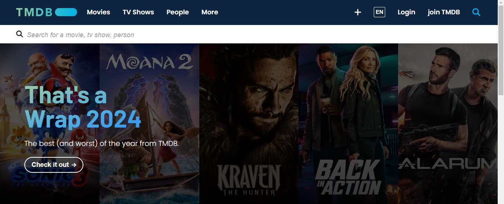

# TMDB Clone



## Project Overview
This project is a clone of TMDB (The Movie Database) that provides information about movies, TV shows, and people in the film industry.

## Features
- Browse movies and TV shows
- View detailed information about actors
- Responsive design
- Fetches data dynamically

## Folder Structure
```
C:.
|   file_structure.txt
|   index.html
|   
+---assets
|   +---imgs
|   |       apple-touch-icon.png
|   |       favicon-32x32.png
|   |       other-images.svg
|   |
|   +---scripts
|   |       movie.js
|   |       movieCollection.js
|   |       people.js
|   |       peoplecollection.js
|   |       script.js
|   |       tv.js
|   |       tvcollection.js
|   |
|   +---styles
|   |       global.css
|   |       landing.css
|   |       people.css
|   |       style.css
|   |       tv.css
|   |
|   \---utils
|           api.js
|           config.js
|
\---pages
        movie.html
        moviesCollection.html
        people.html
        peopleCollection.html
        tv.html
        TVCollection.html
```

## Installation
To clone this repository, run the following command:
```sh
git clone https://github.com/Ayman-Elfeky/TMDB-clone.git
```

## Before You Start! Generate Your Api (!important)
- before you start your project generate an api key from (https://developer.themoviedb.org/docs/getting-started).
- create config.js file inside utils folder and assign your apikey as `const apiKey = YOUR_API_KEY`
  

## Usage
1. Open `index.html` in a browser.
2. Explore movies, TV shows, and people.

## Technologies Used
- HTML
- CSS
- JavaScript
